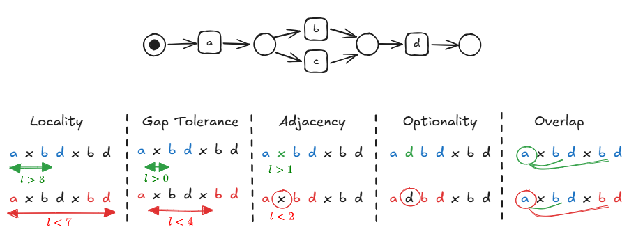

# ADR-0001: Data Storage Format

**Status:** Draft  
**Date:** 2026-04-17  
**Authors:** VikiPeeva  
**Reviewers:** @alkuzman, @david, @lukas  
**Replaces:** –  
**Superseded by:**

---

## Context

We need to store _Local Process Models (LPMs) and their occurrence lists in an event log_. Event log sizes can vary, 
but from the standard ones used for research in process mining, they go up to 1.GB. LPMs are usually small models 
covering on average up to five activities, but for a single event log tens of thousands can be discovered. 
Moreover, LPMs can come with additional attributes about them, either computed from the occurrence lists or maybe 
manual annotations.

If one wants to be future-proof, a pessimistic estimation for size could be event logs processed by Celonis 
(from a couple of hundreds GB to TB of data).

## Decision Drivers

The choice affects:
- portability,
- storage efficiency,
- long-term maintenance cost,
- operational complexity,
- query performance (future),
- streaming (future).

Expected access patterns for the data currently are:
- Complete read/write
- Streamed read/write
- Random access read/write
- Query-based read/write

There also exist various ways one can align LPMs to an event log:
- The storage focuses on one variation
- The storage includes occurrence lists for multiple variations


## Options Considered

### Option A: ZIP of models and XES

Each LPM is stored in a separate file (the format can be any of the process model formats, pnml, bpmn, 
pt, etc.). The occurrence list is stored directly in the event log such that for each event in the XES  
there is an attribute `covering-lpms` where all LPM ids of the LPMs covering the event are listed. We use the file 
name of each LPM as the id to denote it in the list.

#### Example:
$L = \langle a, b, a, c, d\rangle, \langle a, x, d\rangle$

$lpm1$: a -> d

$lpm2$: a -> b -> d

```xml
<?xml version="1.0" encoding="UTF-8" ?>
<log xes.version="1.0" xes.features="nested-attributes" openxes.version="1.0RC7">
	<trace>
		<event>
			<string key="concept:name" value="a"/>
			<list key="covering-lpms" value="[lpm1, lpm2]"/>
		</event>
		<event>
			<string key="concept:name" value="b"/>
			<list key="covering-lpms" value="[lpm2]"/>
		</event>
        <event>
            <string key="concept:name" value="a"/>
            <list key="covering-lpms" value="[lpm1]"/>
        </event>
		<event>
			<string key="concept:name" value="c"/>
			<list key="covering-lpms" value="[]"/>
		</event>
		<event>
			<string key="concept:name" value="d"/>
			<list key="covering-lpms" value="[lpm1, lpm2]"/>
		</event>
	</trace>
	<trace>
		<event>
			<string key="concept:name" value="a"/>
			<list key="covering-lpms" value="[lpm1]"/>
		</event>
		<event>
			<string key="concept:name" value="d"/>
			<list key="covering-lpms" value="[lpm1]"/>
		</event>
	</trace>
</log>

```


**Pros**
- Using only existing formats

**Cons**
- Complete occurrence lists need to be reconstructed
- Additional attributes for the models cannot be stored
- Misusing the xes standard

**Alternatives**

To be able to store additional attributes, a new format for the models can be introduced or additional json file 
can be used only for storing the additional attributes.

### Option B: Separate Full Alignments File in Human-Readable Format (e.g., JSON)

For each set of models for which an occurrence list is computed, a report is generated that includes:
- lpm set info,
- event log info,
- aligned traces per LPM

#### Example:
$L = \langle a, b, a, c, d\rangle, \langle a, x, d\rangle$

$lpm1$: a -> d

$lpm2$: a -> b -> d

```json
 {
  "meta": {
    "eventlog": "name-id",
    "lpm_set": "name-id",
    "variant": ["gapped-2", "local-4"]
  },
 "alignments": {
   "lpm1": {
     "t1": {
       "e1": "t_a", 
       "e2": ">>",
       "e3": "t_a",
       "e4": ">>", 
       "e5": "t_d"
     }, 
     "t2": {
       "e1": "t_a", 
       "e2": ">>", 
       "e3": "t_d"
     }
   }, 
   "lpm2": {
     "t1": {
       "e1": "t_a", 
       "e2": "t_b",
       "e3": ">>",
       "e4": ">>",
       "e5": "t_d"
     }, 
     "t2": {
       "e1": ">>",
       "e2": ">>",
       "e3": ">>"
     }
   }
 }
}
```

**Pros**
- Alignments are directly available

**Cons**
- Problematic when one event is in two alignments of the same LPM
- The entire event log is duplicated for each LPM

**Alternatives**
Same as with Option A, where each event occurs once, but in a separate alignment file in JSON format.

### Option C: Separate Occurrence List File in Human-Readable Format (e.g., JSON)

For each set of models for which an occurrence list is computed, a report is generated that includes:
- lpm set info,
- event log info,
- occurrence list

#### Example:
$L = \langle a, b, a, c, d\rangle, \langle a, x, d\rangle$

$lpm1$: a -> d

$lpm2$: a -> b -> d

```json
{ 
 "meta": {
	 "eventlog": "name-id",
	 "lpm_set": "name-id",
	 "variant": ["gapped-2", "local-4"]
 },
 "alignments": {
   "lpm1": {
     "alignment1": ["t1-e1", "t1-e5"],
     "alignment2": ["t1-e3", "t1-e5"],
     "alignment3": ["t2-e1", "t2-e3"]
   },
   "lpm2": {
     "alignment1": ["t1-e1", "t1-e2", "t1-e5"]
   }
 }
}
```

**Pros**
- Occurrence lists are directly available
- Additional LPM attributes can be stored

**Cons**
- Events are multiplied for each alignment and LPM pair

## Decision

<!-- To be filled in once review is complete. -->

## Consequences

<!-- To be filled in once review is complete. -->

## References

- 
